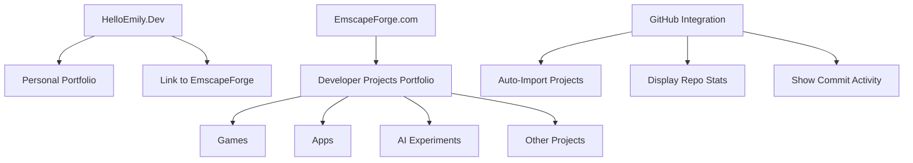

# EmscapeForge.com Rebranding Ideas

## Project Overview

## 1. Domain and Site Structure Setup

### 1.1 Domain Configuration
- Update CNAME file to point to emscapeforge.com for the projects page
- Create a new GitHub repository for emscapeforge.com (or use a branch of the current repo)
- Configure GitHub Pages to serve the site from the new domain

### 1.2 Site Structure
- Create a new landing page for emscapeforge.com
- Maintain a link from HelloEmily.Dev to EmscapeForge.com
- Design navigation between the two sites

## 2. Design and Branding

### 2.1 Visual Identity
- Create a new logo and color scheme for EmscapeForge
- Design a modern, developer-focused layout
- Implement responsive design for all device sizes

### 2.2 Layout Improvements
- Create a grid-based project showcase with filtering options
- Add project categories (Games, Apps, AI Experiments, etc.)
- Implement a search function for projects
- Add a featured projects section

## 3. GitHub Integration Enhancements

### 3.1 Automated Project Import
- Create a script to automatically import GitHub repositories
- Pull repository metadata (description, languages, stars, forks)
- Generate project cards from GitHub data

### 3.2 Repository Statistics
- Display repository stats (stars, forks, watchers)
- Show language breakdown with visual indicators
- Include last update timestamp

### 3.3 Activity Visualization
- Show commit activity graph for each project
- Display contributor information
- Include pull request and issue statistics

## 4. Project Content Updates

### 4.1 Add New Projects
- Add QuizInMyApp project with details and screenshots
- Add SkolVikings project with details and screenshots
- Import other relevant GitHub repositories

### 4.2 Project Detail Pages
- Create detailed pages for each project
- Include project goals, challenges, and solutions
- Add screenshots, demos, and technical details
- Link to live versions and source code

## 5. Technical Implementation

### 5.1 Data Structure
- Update projects-data.json to include new fields for GitHub integration
- Create a GitHub API integration script
- Implement caching to reduce API calls

### 5.2 Frontend Development
- Update HTML/CSS for the new design
- Enhance JavaScript for dynamic content loading
- Implement filtering and search functionality

### 5.3 Performance Optimization
- Optimize image loading and caching
- Implement lazy loading for project cards
- Ensure fast page load times

## 6. Testing and Deployment

### 6.1 Testing
- Test on multiple browsers and devices
- Verify GitHub API integration
- Check performance metrics

### 6.2 Deployment
- Deploy to GitHub Pages
- Configure custom domain
- Set up HTTPS

## 7. Social Media Integration

### 7.1 Included Platforms
- Facebook integration for sharing projects
- Bluesky integration for updates and sharing

### 7.2 Meta Tags and Sharing
- Update all meta tags to support Facebook Open Graph
- Add Bluesky meta tags when they become standardized
- Remove all Twitter/X meta tags and integrations

## GitHub Integration Suggestions

1. **Repository Auto-Import**:
   - Automatically import repositories from your GitHub account
   - Filter by topics or specific repositories
   - Update project data when repositories change

2. **Repository Statistics**:
   - Stars, forks, and watchers count
   - Language breakdown with percentage bars
   - Contributor list with avatars

3. **Commit Activity**:
   - Commit frequency graph
   - Recent commits list
   - Contribution calendar (similar to GitHub's)

4. **README Integration**:
   - Parse README.md files for project descriptions
   - Extract images and formatting
   - Show project documentation

5. **Issue and PR Tracking**:
   - Display open issues count
   - Show recent pull requests
   - Link to GitHub issues page

## Blog-Post.html Updates

The blog-post.html file needs to be updated to:
1. Remove all Twitter meta tags
2. Ensure Facebook Open Graph tags are properly configured
3. Add Bluesky meta tags when they become standardized