# Plan: Automated Project Card Addition (Markdown Input)

This document outlines the plan for creating a process to automatically add new project cards to the `projects.html` page by updating the `projects/projects-data.json` file using a Markdown file as input.

## 1. Goal

Create a PowerShell script named `add-new-project.ps1`. This script will read project details from a specified Markdown file's YAML frontmatter and automatically update the `projects/projects-data.json` file.

## 2. Input Method

A dedicated Markdown file (`.md`) for each new project, containing YAML frontmatter with all the necessary project details.

## 3. Template File

A template file, `projects/template-project.md`, will be created to ensure consistency. Users will copy and fill out this template for each new project.

**Proposed `projects/template-project.md` Content:**

```yaml
---
title: "" # REQUIRED: Project Title
shortDescription: "" # REQUIRED: Short description for card view
longDescription: "" # REQUIRED: Longer description for project page/modal
technologies: # REQUIRED: List of technologies used
  - ""
  # - "Another Technology"
featuredImage: "" # REQUIRED: Relative path to the main project image (e.g., projects/your-id/main.png)
images: # REQUIRED: List of relative paths to project images (include featuredImage again if desired)
  - ""
  # - "projects/your-id/detail.png"
githubUrl: "" # Optional: Full URL to the GitHub repository
liveUrl: "" # Optional: Full URL to the live project/demo
blogPostUrl: "" # Optional: Relative URL to the blog post (e.g., blog-post.html?id=your-post-id)
featured: false # REQUIRED: Set to true if this project should be featured prominently
completionDate: "" # REQUIRED: Date in YYYY-MM format (e.g., 2025-04)
---

# Notes (Optional):
# - This section is ignored by the script.
# - Ensure all image paths are relative to the root directory.
# - Create the project ID directory (e.g., projects/your-project-id/) and place images there first.
# - For blogPostUrl, use the format 'blog-post.html?id=your-blog-post-slug'.

```

## 4. Script Functionality (`add-new-project.ps1`)

*   **Parameter:** Accepts the path to the input Markdown file (`-InputFile`).
*   **YAML Parsing:** Reads the input file, extracts and parses the YAML frontmatter. (May require `powershell-yaml` module or regex).
*   **Data Processing:**
    *   Retrieves all fields from YAML.
    *   Generates a unique `id` from the `title`.
    *   Validates required fields and data formats.
*   **JSON Update:**
    *   Reads `projects/projects-data.json`.
    *   Parses JSON.
    *   Creates and adds the new project object to the `.projects` array.
    *   Writes the updated, formatted JSON back to `projects/projects-data.json`.
*   **File Archiving:** Moves the processed input Markdown file to `projects/processed-markdown/`.
*   **Confirmation:** Displays a success message.
*   **Error Handling:** Includes checks for file existence, YAML/JSON parsing errors, and missing required fields.

## 5. Process Flow

```mermaid
graph LR
    A[User: Copies projects/template-project.md to new file] --> B(User: Fills in YAML frontmatter in new file);
    B --> C(User: Runs `.\add-new-project.ps1 -InputFile .\path\to\new-project.md`);
    C --> D(Script: Reads new-project.md);
    D --> E(Script: Parses YAML frontmatter);
    E --> F(Script: Validates data, generates ID);
    F --> G(Script: Reads projects-data.json);
    G --> H(Script: Parses JSON);
    H --> I(Script: Adds new project object to array);
    I --> J(Script: Converts back to formatted JSON);
    J --> K(Script: Writes updated JSON to projects-data.json);
    K --> L(Script: Moves new-project.md to projects/processed-markdown/);
    L --> M(Script: Displays Success Message);
```



## 6. Manual Steps (Prerequisites)

*   Create the `projects/template-project.md` file with the content defined above.
*   Create the `projects/processed-markdown/` directory.
*   Place project images in their respective directories (e.g., `projects/your-project-id/`) *before* creating the Markdown file.
*   Ensure a corresponding blog post exists and its URL is known if planning to link one.

## 7. Implementation

The next step is to implement the `projects/template-project.md` file and the `add-new-project.ps1` script. This will likely involve switching to Code mode.