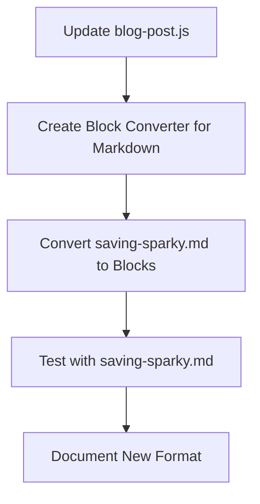

# Blog Structure Update Plan

## Overview

This plan outlines the implementation of changes to support a new blog structure format, focusing on adapting the saving-sparky.md draft to work with the block-based content parser. The approach aligns with the existing plan to transition the blog system to a more structured block-based format.



## Phase 1: Update blog-post.js to Use the Block-Based Parser

### Current State
Currently, blog-post.js directly inserts the post.content into the HTML without using the content parser:
```javascript
<div class="blog-post-content">
    ${post.content}
</div>
```

### Changes Needed
1. Update the displayBlogPost function to use the BlogContentParser:
   - Initialize the content parser
   - Check if the post has blocks or legacy content
   - Parse the content accordingly

### Implementation Details
```javascript
function displayBlogPost(post) {
    // ... existing code ...
    
    // Initialize content parser
    const contentParser = new BlogContentParser();
    
    // Parse content based on format
    let parsedContent;
    if (post.blocks && Array.isArray(post.blocks)) {
        // New format: content is stored as blocks
        parsedContent = contentParser.parseBlocks(post.blocks);
    } else if (post.content) {
        // Legacy format: content is stored as HTML string
        const legacyBlocks = contentParser.parseLegacyContent(post.content);
        parsedContent = contentParser.parseBlocks(legacyBlocks);
    } else {
        parsedContent = '<p>No content available</p>';
    }
    
    // Build post HTML with parsed content
    container.innerHTML = `
        <article class="blog-post">
            ${featuredImageHtml}
            <div class="blog-post-header">
                <h2>${post.title}</h2>
                <div class="blog-meta">
                    <span class="blog-date">${formattedDate}</span>
                    <span class="blog-author">By ${post.author}</span>
                </div>
                <div class="blog-tags">
                    ${tagsHTML}
                </div>
            </div>
            <div class="blog-post-content">
                ${parsedContent}
            </div>
            ${post.additionalImages && post.additionalImages.length > 0 ? renderAdditionalImages(post.additionalImages, post.title) : ''}
        </article>
    `;
    
    // ... rest of existing code ...
}
```

## Phase 2: Create a Markdown to Block Converter

### Purpose
Create a utility that can convert markdown content (like saving-sparky.md) into the block-based format expected by the content parser.

### Implementation Details
1. Create a new file: `js/md-to-blocks.js`
2. Implement functions to:
   - Parse markdown headings into block structure
   - Convert markdown images to image blocks
   - Convert markdown paragraphs to text blocks
   - Handle other markdown elements (lists, code blocks, etc.)

```javascript
/**
 * Markdown to Blocks Converter
 * Converts markdown content to block-based format
 */
class MarkdownToBlocks {
    /**
     * Convert markdown to blocks
     * @param {string} markdown - Markdown content
     * @returns {Array} - Array of content blocks
     */
    convert(markdown) {
        const lines = markdown.split('\n');
        const blocks = [];
        let currentBlock = null;
        
        for (let i = 0; i < lines.length; i++) {
            const line = lines[i];
            
            // Handle headings
            if (line.startsWith('# ')) {
                blocks.push({
                    type: 'text',
                    content: `<h1>${line.substring(2)}</h1>`
                });
                continue;
            }
            
            if (line.startsWith('## ')) {
                blocks.push({
                    type: 'text',
                    content: `<h2>${line.substring(3)}</h2>`
                });
                continue;
            }
            
            if (line.startsWith('### ')) {
                blocks.push({
                    type: 'text',
                    content: `<h3>${line.substring(4)}</h3>`
                });
                continue;
            }
            
            // Handle images with support for various formats
            const imageMatch = line.match(/!\[(.*?)\]\((.*?)\)/);
            if (imageMatch) {
                const imagePath = imageMatch[2];
                const imageAlt = imageMatch[1];
                
                // Check if image format is supported
                const supportedFormats = ['.jpg', '.jpeg', '.png', '.webp'];
                const fileExtension = imagePath.substring(imagePath.lastIndexOf('.')).toLowerCase();
                
                if (supportedFormats.includes(fileExtension) || 
                    supportedFormats.some(format => imagePath.toLowerCase().includes(format))) {
                    blocks.push({
                        type: 'image',
                        src: imagePath,
                        alt: imageAlt,
                        size: 'medium',
                        position: 'center'
                    });
                } else {
                    console.warn(`Unsupported image format: ${imagePath}`);
                    // Add as text block with warning
                    blocks.push({
                        type: 'text',
                        content: `<p><em>Image with unsupported format: ${imagePath}</em></p>`
                    });
                }
                continue;
            }
            
            // Handle paragraphs
            if (line.trim() !== '') {
                // Process markdown formatting
                let content = line
                    .replace(/\*\*(.*?)\*\*/g, '<strong>$1</strong>')
                    .replace(/\*(.*?)\*/g, '<em>$1</em>')
                    .replace(/\[(.*?)\]\((.*?)\)/g, '<a href="$2">$1</a>');
                
                blocks.push({
                    type: 'text',
                    content: `<p>${content}</p>`
                });
            }
        }
        
        return blocks;
    }
}
```

## Phase 3: Convert saving-sparky.md to Block Format

### Steps
1. Read the saving-sparky.md file
2. Extract metadata (title, author, date, etc.)
3. Convert the content to blocks using the MarkdownToBlocks converter
4. Create a new JSON structure for the post

### Implementation Details
Update the md-to-blog.js script to use the new MarkdownToBlocks converter:

```javascript
// Add to md-to-blog.js
const MarkdownToBlocks = require('./md-to-blocks');

function parseMarkdownFile(filePath) {
    const content = fs.readFileSync(filePath, 'utf8');
    const lines = content.split('\n');
    
    // Extract title (first line, remove # prefix)
    const title = lines[0].replace(/^#\s+/, '').trim();
    
    // Check if file has explicit metadata section
    const metadataStartIndex = lines.findIndex(line => line.trim() === '## Metadata');
    
    if (metadataStartIndex !== -1) {
        // Process traditional format
        // ... existing code ...
    } else {
        // Process new format
        // Extract metadata from content
        const metadata = extractMetadataFromContent(lines);
        
        // Convert content to blocks
        const markdownConverter = new MarkdownToBlocks();
        const blocks = markdownConverter.convert(content);
        
        // Generate an ID based on the title
        const id = generateIdFromTitle(title);
        
        return {
            id,
            title,
            shortDescription: extractShortDescription(lines),
            blocks: blocks,
            author: metadata.author || 'Emily Anderson',
            date: metadata.date || new Date().toISOString().split('T')[0],
            tags: metadata.tags || [],
            featuredImage: metadata.featuredImage || '',
            featured: metadata.featured || false
        };
    }
}

function extractMetadataFromContent(lines) {
    const metadata = {};
    
    // Look for date patterns
    const dateMatch = lines.find(line => line.match(/\d{4}-\d{2}-\d{2}/));
    if (dateMatch) {
        const match = dateMatch.match(/\d{4}-\d{2}-\d{2}/);
        if (match) {
            metadata.date = match[0];
        }
    }
    
    // Extract tags from content
    const potentialTags = ['AI', 'Technology', 'Personal', 'Development', 'Tutorial'];
    metadata.tags = potentialTags.filter(tag => 
        lines.some(line => line.toLowerCase().includes(tag.toLowerCase()))
    );
    
    // Look for images that might be featured
    const featuredImageMatch = lines.find(line => 
        line.match(/!\[.*?\]\(.*?\)/) && 
        (line.toLowerCase().includes('featured') || line.toLowerCase().includes('header'))
    );
    if (featuredImageMatch) {
        const match = featuredImageMatch.match(/!\[.*?\]\((.*?)\)/);
        if (match) {
            metadata.featuredImage = match[1];
        }
    }
    
    return metadata;
}

function extractShortDescription(lines) {
    // Use the first non-empty paragraph after the title as the short description
    for (let i = 1; i < lines.length; i++) {
        if (lines[i].trim() !== '' && !lines[i].startsWith('#') && !lines[i].match(/!\[.*?\]\(.*?\)/)) {
            return lines[i].trim();
        }
    }
    return '';
}
```

## Phase 4: Test with saving-sparky.md

### Steps
1. Run the updated md-to-blog.js script on saving-sparky.md
2. Verify the JSON output is correct
3. Test the blog display with the new format

### Testing Procedure
1. Run the script:
   ```powershell
   node js/md-to-blog.js saving-sparky.md
   ```
2. Check the blog-data.json file to ensure the post was added correctly
3. Open the blog in a browser and navigate to the new post
4. Verify that all content is displayed correctly, including images in supported formats (jpg, jpeg, png, webp)

## Phase 5: Document the New Format

### Documentation Updates
1. Update the blog-drafts/README.md to document both formats:
   - Traditional format with explicit sections
   - New format with markdown content

2. Create a guide for converting between formats

### Implementation Details
Add to blog-drafts/README.md:
```markdown
## Alternative Format

In addition to the structured format above, you can also use a more natural markdown format:

```markdown
# Title of Your Blog Post

Introduction paragraph that will be used as the short description.


## Section Heading

Your content here with **bold text**, *italic text*, and [links](https://example.com).

### Subsection

More content...
```

The system will automatically:
- Use the first paragraph as the short description
- Extract metadata from the content
- Convert the markdown to the appropriate block format

### Supported Image Formats

The following image formats are supported:
- JPG/JPEG
- PNG
- WebP

Images should be placed in a dedicated folder in the `images/blog/` directory following the naming conventions described above.
```

## Benefits of This Approach

1. **Forward Compatibility**: Aligns with the planned transition to a block-based content system
2. **Flexibility**: Supports both traditional and new markdown formats
3. **Better Content Structure**: Enables rich content with different block types
4. **Improved Maintainability**: Separates content parsing from display logic
5. **Image Format Support**: Handles common web image formats (jpg, jpeg, png, webp)

## Next Steps

After approval of this plan:
1. Implement the changes in Code mode
2. Test with the saving-sparky.md draft
3. Document the new format for future blog posts