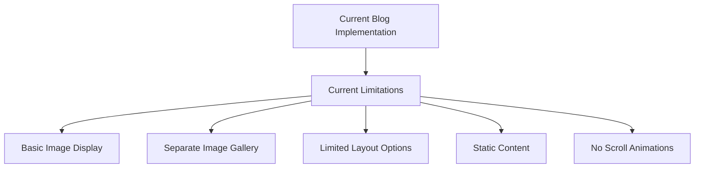
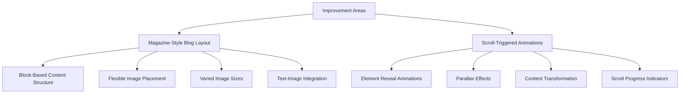
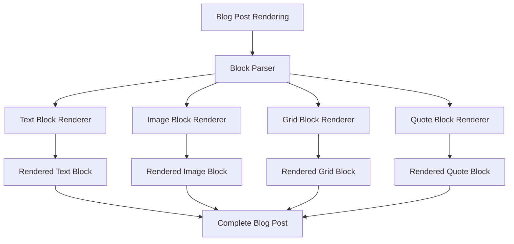
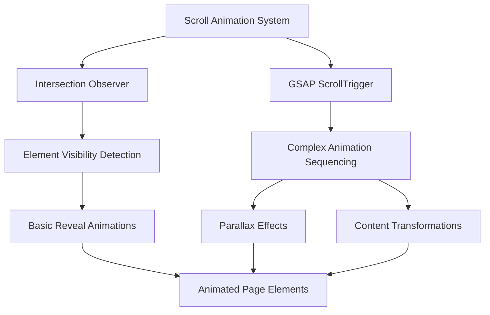

# Website Improvement Plan: Magazine-Style Blog Layout with Scroll Animations

Based on your feedback, I've created a detailed plan focusing on implementing a magazine-style layout for your blog with integrated images and adding scroll-triggered animations to modernize the look and feel of your website.

## Current State Analysis



### Current Limitations:
- Blog content is inserted as a single HTML block
- Images are either displayed as a featured image or in a separate gallery section
- No way to integrate images within the text in a magazine-style layout
- Static content with minimal animations
- No scroll-triggered effects

## Improvement Plan



### 1. Magazine-Style Blog Layout Implementation

#### 1.1 Restructure Blog Data Format
- Modify `blog-data.json` to support a block-based content structure
- Replace the current HTML string content with a structured array of content blocks
- Each block will have a type and associated data

```json
{
  "content": [
    {
      "type": "text",
      "content": "<p>Paragraph content here...</p>"
    },
    {
      "type": "image",
      "src": "path/to/image.jpg",
      "alt": "Image description",
      "caption": "Optional caption",
      "size": "medium", // small, medium, large, full
      "position": "left" // left, right, center
    },
    {
      "type": "text",
      "content": "<p>More paragraph content...</p>"
    },
    {
      "type": "image-grid",
      "images": [
        {
          "src": "path/to/image1.jpg",
          "alt": "Image 1 description",
          "caption": "Caption 1"
        },
        {
          "src": "path/to/image2.jpg",
          "alt": "Image 2 description",
          "caption": "Caption 2"
        }
      ],
      "layout": "2-column" // 2-column, 3-column, masonry
    }
  ]
}
```

#### 1.2 Create a Block Renderer System
- Develop a JavaScript module to render different content block types
- Implement specific renderers for each block type:
  - Text blocks
  - Image blocks (with size and position options)
  - Image grid blocks
  - Quote blocks
  - Code blocks
  - Video blocks

#### 1.3 Implement Magazine-Style Layout
- Create a CSS grid-based layout system for blog posts
- Support varied image sizes and positions:
  - Small images (25-33% width)
  - Medium images (50% width)
  - Large images (75% width)
  - Full-width images (100% width)
- Implement image positioning options:
  - Left-aligned with text wrap
  - Right-aligned with text wrap
  - Center-aligned with text above/below
- Add support for image grids and galleries within the content
- Implement image captions and attribution

#### 1.4 Enhance Typography for Magazine Feel
- Improve typography with varied font sizes and weights
- Add drop caps for section beginnings
- Implement pull quotes for important text
- Create styled section dividers

### 2. Scroll-Triggered Animation Implementation

#### 2.1 Add Animation Libraries
- Integrate modern animation libraries:
  - GSAP (GreenSock Animation Platform) for complex animations
  - Intersection Observer API for scroll-triggered animations
  - ScrollTrigger plugin for GSAP

#### 2.2 Implement Element Reveal Animations
- Create fade-in animations for content blocks as they enter the viewport
- Add staggered reveal animations for lists and grid items
- Implement slide-in animations for images and quotes

#### 2.3 Add Parallax Effects
- Create subtle parallax effects for featured images
- Implement background parallax for section backgrounds
- Add depth to the page with multi-layer parallax

#### 2.4 Implement Content Transformation Animations
- Add scale and opacity changes based on scroll position
- Create text animations that respond to scroll
- Implement image zoom effects triggered by scrolling

#### 2.5 Add Scroll Progress Indicators
- Create a progress bar showing reading position
- Implement scroll-to-top button that appears when scrolling down
- Add animated section indicators for long-form content

## Technical Implementation Details

### Blog Structure Changes



1. Create a new `blog-content-parser.js` module:
   - Parse the new block-based content structure
   - Dispatch rendering to appropriate block renderers
   - Assemble the complete blog post

2. Update `blog-post.js` to use the new parser:
   - Modify the `displayBlogPost` function to handle the new content format
   - Add support for the new block types
   - Implement fallback for legacy content format

3. Create CSS classes for magazine-style layout:
   - Grid-based layout system
   - Varied image size and position classes
   - Typography enhancements
   - Caption and attribution styles

### Scroll Animation Implementation



1. Create a new `scroll-animations.js` module:
   - Set up Intersection Observer for basic reveal animations
   - Configure GSAP and ScrollTrigger for complex animations
   - Define animation presets for different element types

2. Implement animation triggers:
   - Add data attributes to elements for animation configuration
   - Create animation classes for different effects
   - Set up scroll listeners for parallax effects

3. Optimize performance:
   - Use CSS properties that trigger GPU acceleration
   - Implement debouncing for scroll events
   - Lazy-initialize animations for off-screen elements

## Implementation Approach

### Phase 1: Blog Structure Redesign
1. Create the new content block structure
2. Implement the block parser and renderers
3. Update the blog post display logic
4. Create CSS for magazine-style layout
5. Test with sample content

### Phase 2: Scroll Animation Framework
1. Set up animation libraries
2. Create the scroll animation module
3. Implement basic reveal animations
4. Test performance across devices

### Phase 3: Advanced Animations
1. Implement parallax effects
2. Add content transformation animations
3. Create scroll progress indicators
4. Fine-tune timing and easing

### Phase 4: Content Migration
1. Convert existing blog posts to the new format
2. Add animation attributes to page elements
3. Test and refine animations
4. Optimize for performance

## Technical Considerations

### Performance Optimization
- Lazy load images and animations
- Use CSS animations where possible for better performance
- Implement debouncing for scroll events
- Consider reduced motion preferences for accessibility

### Browser Compatibility
- Ensure animations work across modern browsers
- Implement fallbacks for older browsers
- Test on various devices and screen sizes

### Accessibility
- Respect user preferences for reduced motion
- Ensure animations don't interfere with screen readers
- Maintain proper focus management during transitions